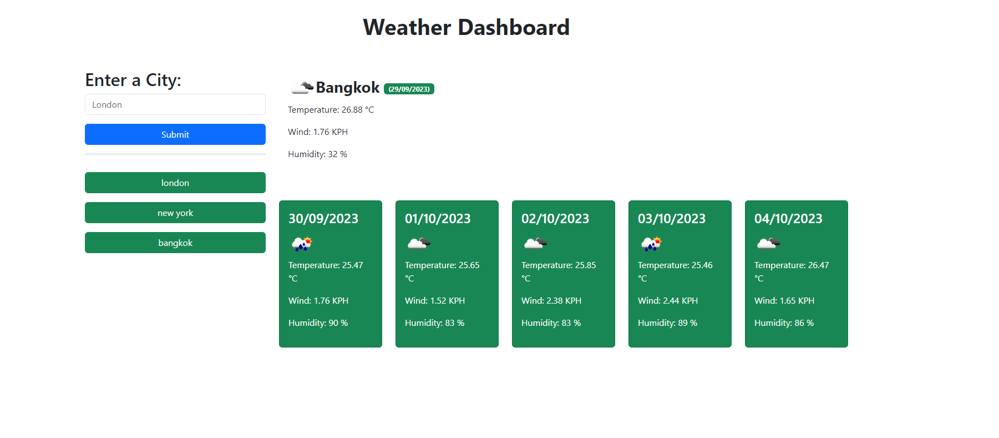

# weather-dashboard

# Project Title

Weather Dashboard

## Table of Contents

- [Project Description](#project-description)
- [Installation](#installation)
- [Usage](#usage)
- [Features](#features)
- [Technologies Used](#technologies-used)
- [Contributing](#contributing)
- [License](#license)

## Project Description

This is a weather dashboard that provides details about the weather iny any city typed in the search box

## Installation

Provide step-by-step instructions on how to install and set up your project. Include any dependencies that need to be installed and how to install them.

## Features

Once a city is typed in, users can see the temperature, wind and humidity stats for the next 5 days.

## Technologies Used

- List the technologies, frameworks, libraries, and tools used in your project. For example:
  - HTML
  - JavaScript
  - Bootstrap

## License

MIT

## Additional Sections (optional)

